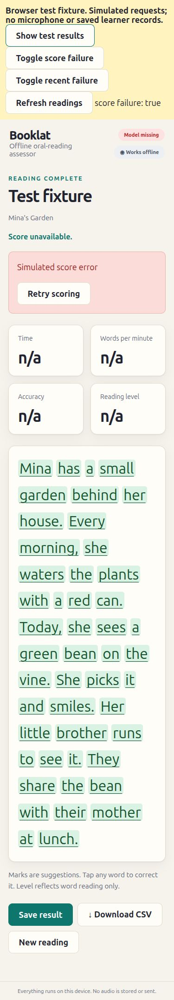

# Approved fixes 1–5

All five findings from `audit-001-2026-10-09.md` were approved and fixed in `web/index.html`.

## Changes and scoped delivery gate

- R-25 PASS: Amber label text now uses `#854d0e` on `#fef3c7`, measured at 6.15:1 by the supplied contrast checker. This reuses the existing repeated-word ink and retains the amber status meaning.
- R-27 PASS: Pending scores clear the preceding values and display “Calculating score…”. Failed requests display “Score unavailable.” with `n/a` values. Editing also clears old values during the debounce interval. Late errors from superseded requests, revisions, or sessions cannot replace current results.
- R-27 PASS: Recent readings shows loading, empty, error, or populated states. Successful refreshes reset prior error text; pending/failed refreshes hide the previous table. Recent readings still loads if passage loading fails.
- R-32 PASS: Escape hides the editor and returns focus to the selected word. Pointer dismissal and screen changes do not steal focus.
- R-02 PASS: No em dash remains in the interface source. Latency uses `n/a`; diagnostics use parentheses.
- R-26 PASS for affected controls: Retry scoring, all five word-edit buttons, Save result, and New reading were exercised in the browser against simulated responses.
- R-33 PASS: Changes were made directly in the application source. Test fixtures do not modify application files.
- R-35 PASS for the changed frontend: Inline JavaScript parses, eight regression tests pass, and browser checks below confirm the affected behavior. This does not certify real speech recognition or the full backend.

The purpose of the added status text is to distinguish pending and unavailable data from real scores. All metrics are cleared together so they cannot refer to different revisions or learners. Focus restoration preserves the teacher's position in the passage.

The existing B10 visual direction is retained: warm paper surfaces, teal actions, system typography, and separate setup/reading/results screens. ENERGY 1 / RHYTHM 1 / MOTION 1 remains unchanged. No assets, themes, claims, navigation destinations, or decorative techniques were added. These targeted corrections do not constitute a new whole-app design audit.

## Browser evidence

The actual frontend was served locally with a temporary, clearly labeled fixture that supplied simulated requests. It used no microphone and wrote no learner records. The temporary fixture is outside the repository and is not a runtime dependency.

- Open results: all four tiles showed `n/a` and “Calculating score…” before the response.
- Open a word with Enter: editor opened and its Correct button received focus.
- Press Escape: editor closed; the same passage word was the active DOM element.
- Force a score failure after a successful reading: all four tiles showed `n/a`, “Score unavailable.” appeared, and Retry scoring was available.
- Retry scoring after restoring responses: accuracy returned to 100.0%, and the error disappeared.
- Save result: button changed to “Saved ✓” with a success message.
- New reading: setup reopened.
- Force a recent-readings error: error appeared and the previous table was hidden.
- Restore responses and refresh: table reappeared and the error disappeared.
- Wrong: breakdown changed to Wrong 1.
- Skipped: breakdown changed to Skipped 1 and Wrong 0.
- Repeated: breakdown changed to Repeated 1.
- Correct: breakdown changed to Skipped 0 while retaining the repetition.
- Not read: word became not reached and its repetition cleared.
- Mobile results at 390 × 844: document width was 375 pixels, with no horizontal overflow. The unavailable-score message, retry control, and tiles remained readable.
- Captured browser error logs were empty for the simulated-response fixture.

## Automated checks

- `node tests/browser_ui.cjs`: 8 tests passed. Covers state recovery, passage-load failure, scoring failure/retry, late response isolation, edit debounce, saving, and Escape focus restoration.
- Existing audio-worklet self-check: passed at four sample rates with both frame sizes, including final-buffer flush.
- Python source compilation: passed for server, scripts, and tests.
- `git diff --check`: passed.
- Contrast: 6.15:1, passing normal and large text thresholds.

`tests/test_browser_ui.py` integrates the Node checks into the existing pytest suite. Tests introduce no new package dependency.

## Remaining verification limits

The full pytest suite could not run because pytest and backend dependencies are absent from the local environment. No packages or models were downloaded. Real microphone capture, Whisper/Vosk recognition, actual CSV persistence, and a full end-to-end backend run remain unverified. The screenshot and browser results demonstrate frontend behavior under simulated responses, not speech recognition accuracy.
